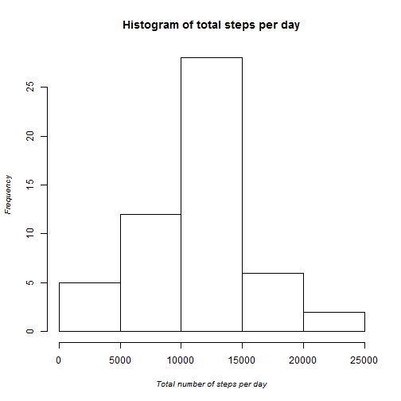
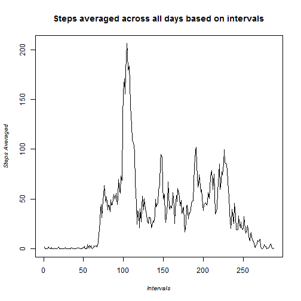
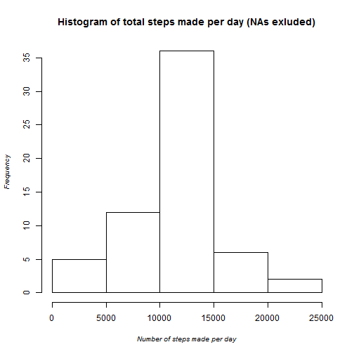
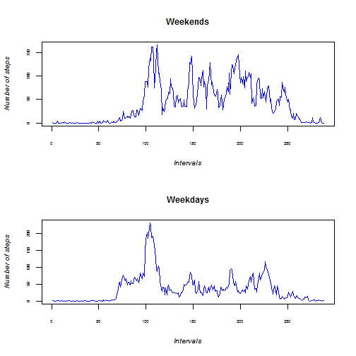

## Loading and preprocessing the data

Show any code that is needed to

1. Load the data (i.e. read.csv())


```r
setwd(".")
#url <- "https://d396qusza40orc.cloudfront.net/repdata%2Fdata%2Factivity.zip"
#download.file(url, destfile="activity.zip", method="curl")
unzip("activity.zip", overwrite=TRUE)
activity <- read.csv("activity.csv")
```
2. Process/transform the data (if necessary) into a format suitable for your analysis

```r
steps_sum <- tapply(activity$steps, activity$date, sum)
steps_sum <- as.data.frame(steps_sum)
steps_sum$steps_sum <- as.numeric(steps_sum$steps_sum)
```

## What is mean total number of steps taken per day?

For this part of the assignment, you can ignore the missing values in the dataset.

1. Make a histogram of the total number of steps taken each day

```r
hist(steps_sum$steps_sum, xlab = "Total number of steps per day", main = "Histogram of total steps per day", cex.main = 1.2, cex.lab=0.8, font.lab = 3)
```

 

2. Calculate and report the mean and median total number of steps taken per day

```r
mean(steps_sum$steps_sum, na.rm=TRUE)
```

```
## [1] 10766.19
```

```r
median(steps_sum$steps_sum, na.rm=TRUE)
```

```
## [1] 10765
```

## What is the average daily activity pattern?

1. Make a time series plot (i.e. type = "l") of the 5-minute interval (x-axis) and the average number of steps taken, averaged across all days (y-axis)

```r
steps_averaged <- tapply(activity$steps, activity$interval, mean, na.rm=TRUE)
steps_averaged <- as.data.frame(steps_averaged)
steps_averaged$steps_averaged <- as.numeric(steps_averaged$steps_averaged)
plot(steps_averaged$steps_averaged, type="l", main="Steps averaged across all days based on intervals", xlab="Intervals", ylab="Steps Averaged", cex.main = 1.2, cex.lab=0.8, font.lab = 3)
```

 

2. Which 5-minute interval, on average across all the days in the dataset, contains the maximum number of steps?

```r
steps_averaged$interval <- rownames(steps_averaged)
steps_averaged[which.max(steps_averaged$steps_averaged),]
```

```
##     steps_averaged interval
## 835       206.1698      835
```

## Imputing missing values

Note that there are a number of days/intervals where there are missing values (coded as NA). The presence of missing days may introduce bias into some calculations or summaries of the data.

1. Calculate and report the total number of missing values in the dataset (i.e. the total number of rows with NAs)

```r
nrow(activity[!complete.cases(activity),])
```

```
## [1] 2304
```

2. Devise a strategy for filling in all of the missing values in the dataset. The strategy does not need to be sophisticated. For example, you could use the mean/median for that day, or the mean for that 5-minute interval, etc.

```r
nd <- merge(activity, steps_averaged, by="interval")
nd <- nd[order(nd$date),]
nd$steps[is.na(nd$steps)] <- nd$steps_averaged[is.na(nd$steps)]
```

3. Create a new dataset that is equal to the original dataset but with the missing data filled in.

```r
steps_sum2 <- tapply(nd$steps, nd$date, sum)
steps_sum2 <- as.data.frame(steps_sum2)
steps_sum2$steps_sum2 <- as.numeric(steps_sum2$steps_sum2)
hist(steps_sum2$steps_sum2, xlab = "Number of steps made per day", main= "Histogram of total steps made per day (NAs exluded)", cex.main = 1.2, cex.lab=0.8, font.lab=3)
```

 

4. Make a histogram of the total number of steps taken each day and Calculate and report the mean and median total number of steps taken per day. Do these values differ from the estimates from the first part of the assignment? What is the impact of imputing missing data on the estimates of the total daily number of steps?

```r
mean_na <- mean(steps_sum$steps_sum, na.rm=TRUE)
median_na <- median(steps_sum$steps_sum, na.rm=TRUE)
mean_nar <- mean(steps_sum2$steps_sum2, na.rm=TRUE)
median_nar <- median(steps_sum2$steps_sum2, na.rm=TRUE)
comp_table <- matrix(c(mean_na, median_na, mean_nar, median_nar), ncol=2)
rownames(comp_table) <- c("Mean", "Median")
colnames(comp_table) <- c("With NAs", "W/o NAs")
comp_table
```

```
##        With NAs  W/o NAs
## Mean   10766.19 10766.19
## Median 10765.00 10766.19
```

## Are there differences in activity patterns between weekdays and weekends?

1. Create a new factor variable in the dataset with two levels -- "weekday" and "weekend" indicating whether a given date is a weekday or weekend day.

```r
Sys.setlocale("LC_TIME", "English")
```

```
## [1] "English_United States.1252"
```

```r
nd$day <- as.Date(nd$date)
nd$day <- weekdays(nd$day, abbreviate=FALSE)
nd$day[nd$day %in% c("Saturday", "Sunday")] <- "weekend"
nd$day[nd$day %in% c("Monday", "Tuesday", "Wednesday", "Thursday", "Friday")] <- "weekday"
```

2. Make a panel plot containing a time series plot (i.e. type = "l") of the 5-minute interval (x-axis) and the average number of steps taken, averaged across all weekday days or weekend days (y-axis). The plot should look something like the following, which was created using simulated data:

```r
weekdays <- nd[nd$day=="weekday",]
weekends <- nd[nd$day=="weekend",]
wd <- as.data.frame(tapply(weekdays$steps, weekdays$interval, mean, na.rm=TRUE))
we <- as.data.frame(tapply(weekends$steps, weekends$interval, mean, na.rm=TRUE))
wd$intervals <- rownames(wd)
we$intervals <- rownames(we)
colnames(wd) <- c("steps", "intervals")
colnames(we) <- c("steps", "intervals")
par(mfrow=c(2,1))
plot(we$steps, type="l", main = "Weekends", cex.lab=0.8, cex.axis=0.5, font.lab=3, cex.main=1, xlab="Intervals", ylab="Number of steps", col="blue")
plot(wd$steps, type="l", main = "Weekdays", cex.lab=0.8, cex.axis=0.5, font.lab=3, cex.main=1, xlab="Intervals", ylab="Number of steps", col="blue")
```

 

This .html file was generated with the following R code:
```text
> library(knitr)
> knit2html("PA1_template.Rmd")
> detach("package:knitr", unload = TRUE)
```

Clean up the enviroment.

```r
rm(list = ls())
```
